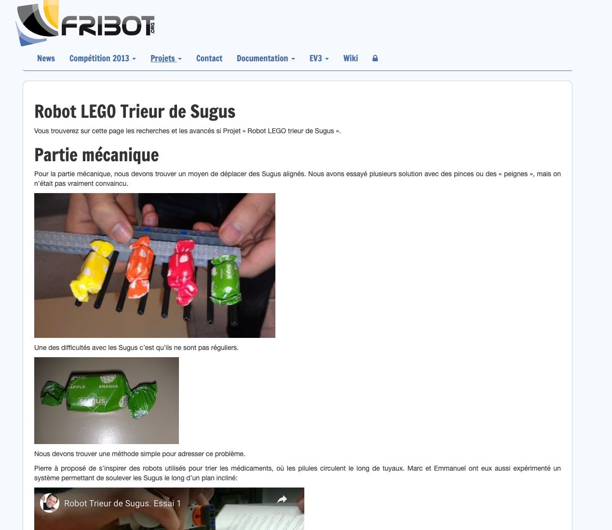
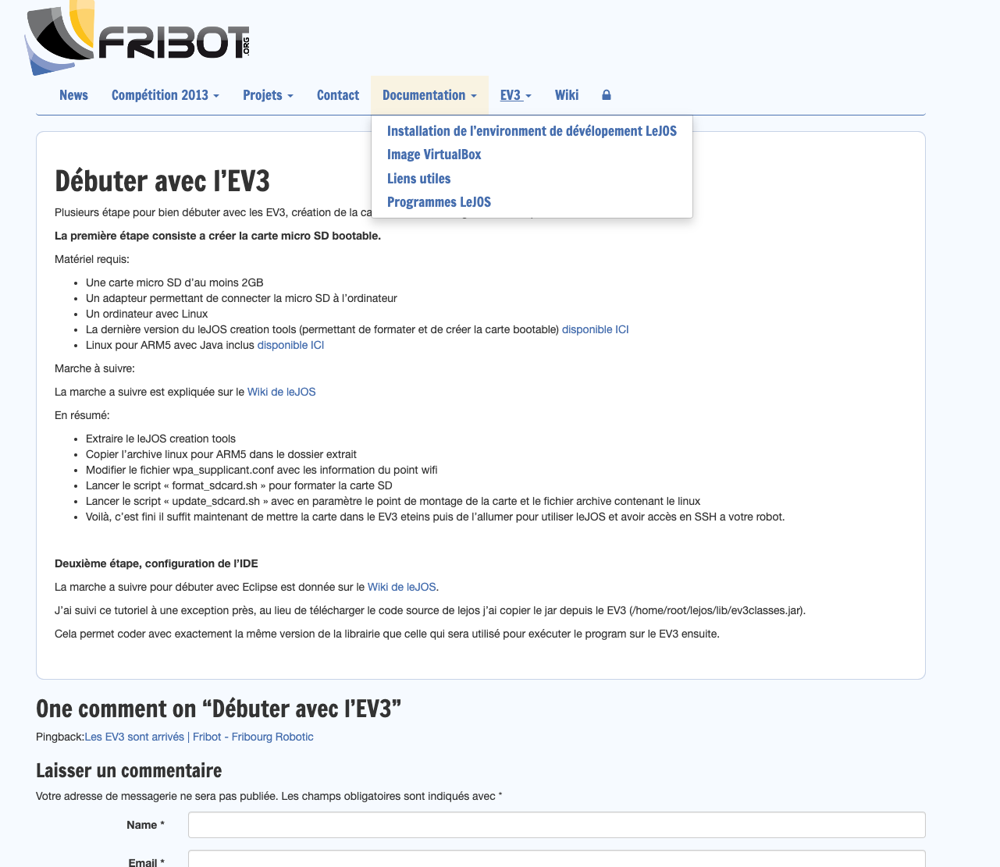

# www.fribot.org

This is a version of the website www.fribot.org I found lying on my NAS, probably from mid-2014.
To keep a trace, I backed it up.

**NOTE**: all user passwords were replaced with `test`.

## How to

1. run `docker compose up -d`
2. go to http://localhost

## Preview

